# Kumanui Theme

[](https://github.com/kjm8/kumanui/releases) [](LICENSE)

📦 [**Download Kumanui 0.1.2**](https://github.com/kjm8/kumanui/releases/download/v0.1.2/kumanui-0.1.2.zip) — latest release package | 🔖 [All releases](https://github.com/kjm8/kumanui/releases)

***Clarity with soft touch.***

Kumanui is a color scheme and design palette inspired by a beloved yellow bear plushie. It is crafted to provide a crisp, clean, and accessible visual experience across terminals, the web, and UI design. Kumanui emphasizes **high contrast for productivity** while keeping a **soft, friendly identity**.

## Usage Examples

See how Kumanui looks and feels in practice.

### Terminals

- macOS Terminal profile: [Kumanui.terminal](dist/macos-terminal/Kumanui.terminal)

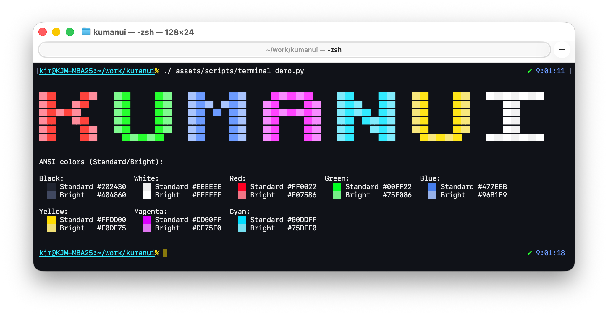

### Websites

- [KJM.ONE](https://www.kjm.one/) — Kumanui-based design

## Quick Start

**macOS Terminal** `[macos-terminal]`

1. Open Terminal.app, then go to `Terminal > Settings > Profiles`
1. Click the gear menu, choose `Import…`, and select `Kumanui.terminal`
1. Set the imported profile as the default

Note: `Kumanui.terminal` targets SF Mono Terminal, which ships with Terminal.app starting in macOS Tahoe (macOS 26). Older versions of macOS may not include this font by default, so set the profile's font manually (for example to SF Mono) and enable the “Antialias text” option in Settings if needed.

**Web (CSS)** `[css]`

```html
<head>
  <link rel="stylesheet" href="kumanui.css">
</head>
```

Kumanui supports both light/dark modes.

## Palette

The palette is organized by hue and tier (base, light, dark) to ensure consistent contrast and harmony across use cases.

<!-- BEGIN:COLORS (generated from tokens/colors.yaml) -->
| 🎨 | Hue | Tier | Hex | RGB | HSL |
|---|-----|------|-----|-----|-----|
|  | Black    | Base  | `#202430` | 32, 36, 48 | 225°, 20%, 16% |
|  | Black    | Light | `#404860` | 64, 72, 96 | 225°, 20%, 31% |
|  | Black    | Dark  | `#101218` | 16, 18, 24 | 225°, 20%, 8% |
|  | White    | Base  | `#EEEEEE` | 238, 238, 238 | 0°, 0%, 93% |
|  | White    | Light | `#FFFFFF` | 255, 255, 255 | 0°, 0%, 100% |
|  | White    | Dark  | `#CCCCCC` | 204, 204, 204 | 0°, 0%, 80% |
|  | Red      | Base  | `#FF0022` | 255, 0, 34 | 352°, 100%, 50% |
| 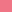 | Red      | Light | `#F07586` | 240, 117, 134 | 352°, 80%, 70% |
|  | Red      | Dark  | `#66000E` | 102, 0, 14 | 352°, 100%, 20% |
| 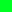 | Green    | Base  | `#00FF22` | 0, 255, 34 | 128°, 100%, 50% |
| 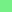 | Green    | Light | `#75F086` | 117, 240, 134 | 128°, 80%, 70% |
| 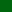 | Green    | Dark  | `#00660E` | 0, 102, 14 | 128°, 100%, 20% |
|  | Blue     | Base  | `#477EEB` | 71, 126, 235 | 220°, 80%, 60% |
|  | Blue     | Light | `#96B1E9` | 150, 177, 233 | 220°, 65%, 75% |
|  | Blue     | Dark  | `#0C2D6E` | 12, 45, 110 | 220°, 80%, 24% |
| 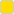 | Yellow   | Base  | `#FFDD00` | 255, 221, 0 | 52°, 100%, 50% |
|  | Yellow   | Light | `#F0DF75` | 240, 223, 117 | 52°, 80%, 70% |
| 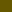 | Yellow   | Dark  | `#665800` | 102, 88, 0 | 52°, 100%, 20% |
| 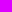 | Magenta  | Base  | `#DD00FF` | 221, 0, 255 | 292°, 100%, 50% |
|  | Magenta  | Light | `#DF75F0` | 223, 117, 240 | 292°, 80%, 70% |
| 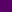 | Magenta  | Dark  | `#580066` | 88, 0, 102 | 292°, 100%, 20% |
| 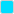 | Cyan     | Base  | `#00DDFF` | 0, 221, 255 | 188°, 100%, 50% |
| 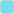 | Cyan     | Light | `#75DFF0` | 117, 223, 240 | 188°, 80%, 70% |
|  | Cyan     | Dark  | `#005866` | 0, 88, 102 | 188°, 100%, 20% |
<!-- END:COLORS -->

## Terminal Colors

<!-- BEGIN:TERMINAL (generated from tokens/colors.yaml) -->
- **Background**: Dark Black `#101218`
- **Text**: Base White `#EEEEEE`
- **Bold Text**: Light White `#FFFFFF`
- **Selection**: Base Yellow `#FFDD00` at 25% opacity
- **Cursor**: Base Yellow `#FFDD00` at 50% opacity
- **ANSI Colors**: Base-tier colors for standard ANSI colors (0-7), and light-tier colors for bright ANSI colors (8-15)
<!-- END:TERMINAL -->

## Web Colors

<!-- BEGIN:WEB (generated from tokens/colors.yaml) -->
### Light Mode
- Background: Light White `#FFFFFF`
- Surface: Base White `#EEEEEE`
- Text: Dark Black `#101218`
- Muted Text: Light Black `#404860`
- Heading: Dark Black `#101218`
- Link: Dark Cyan `#005866`
- Link Hover: Dark Cyan `#005866`
- Border: Light Black `#404860`
- Accent: Dark Cyan `#005866`
- Selection: Base Cyan `#00DDFF` at 25% opacity

### Dark Mode
- Background: Dark Black `#101218`
- Surface: Base Black `#202430`
- Text: Base White `#EEEEEE`
- Muted Text: Dark White `#CCCCCC`
- Heading: Base White `#EEEEEE`
- Link: Base Yellow `#FFDD00`
- Link Hover: Base Yellow `#FFDD00`
- Border: Dark White `#CCCCCC`
- Accent: Base Yellow `#FFDD00`
- Selection: Base Yellow `#FFDD00` at 25% opacity
<!-- END:WEB -->

## Developer Guide

Building and packaging instructions: see [build.md](build.md).

## Contributing

Contributions, suggestions, and feedback are welcome!

- Open an [issue](https://github.com/kjm8/kumanui/issues) to report bugs or request features
- Submit a pull request for improvements
- Share your ideas on new use cases or resources

## License

Released under the MIT License. See the [LICENSE](LICENSE) file for details.