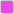
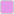
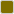

# Kumanui Theme

**Clarity with soft touch.**

Kumanui is a color scheme and design palette inspired by a beloved yellow bear plushie. It is crafted to provide a crisp, clean, and accessible visual experience across terminals, the web, and UI design. Kumanui emphasizes **high contrast for productivity** while keeping a **soft, friendly identity**.

## Primary Palette

<!-- BEGIN:COLORS:PRIMARY (generated from tokens/colors.yaml) -->
| 🎨 | Name | Hex | RGB | HSL |
|---|------|-----|-----|-----|
|  | KumaBlack  | `#101218` | 16, 18, 24 | 225°, 20%, 8% |
|  | KumaWhite  | `#F7F7F7` | 247, 247, 247 | 0°, 0%, 97% |
|  | KumaYellow | `#FFDD00` | 255, 221, 0 | 52°, 100%, 50% |
|  | KumaCyan   | `#00DDFF` | 0, 221, 255 | 188°, 100%, 50% |
<!-- END:COLORS:PRIMARY -->

## Secondary Palette

### Neutrals

<!-- BEGIN:COLORS:NEUTRALS (generated from tokens/colors.yaml) -->
| 🎨 | Tier | Name | Hex | RGB | HSL |
|---|------|------|-----|-----|-----|
|  | Base  | Black | `#404040` | 64, 64, 64 | 0°, 0%, 25% |
|  | Base  | White | `#D9D9D9` | 217, 217, 217 | 0°, 0%, 85% |
|  | Light | Black | `#666666` | 102, 102, 102 | 0°, 0%, 40% |
|  | Light | White | `#FFFFFF` | 255, 255, 255 | 0°, 0%, 100% |
|  | Dark  | Black | `#000000` | 0, 0, 0 | 0°, 0%, 0% |
|  | Dark  | White | `#999999` | 153, 153, 153 | 0°, 0%, 60% |
<!-- END:COLORS:NEUTRALS -->

### Colors by Tier

<!-- BEGIN:COLORS:TIERS (generated from tokens/colors.yaml) -->
| 🎨 | Tier | Hue | Hex | RGB | HSL |
|---|------|-----|-----|-----|-----|
|  | Base  | Red      | `#EB4747` | 235, 71, 71 | 0°, 80%, 60% |
|  | Base  | Green    | `#47EB47` | 71, 235, 71 | 120°, 80%, 60% |
|  | Base  | Blue     | `#477EEB` | 71, 126, 235 | 220°, 80%, 60% |
|  | Base  | Magenta  | `#EB47EB` | 235, 71, 235 | 300°, 80%, 60% |
|  | Base  | Cyan     | `#00DDFF` | 0, 221, 255 | 188°, 100%, 50% |
|  | Base  | Yellow   | `#FFDD00` | 255, 221, 0 | 52°, 100%, 50% |
|  | Light | Red      | `#E69999` | 230, 153, 153 | 0°, 61%, 75% |
|  | Light | Green    | `#99E699` | 153, 230, 153 | 120°, 61%, 75% |
|  | Light | Blue     | `#99BDE6` | 153, 189, 230 | 212°, 61%, 75% |
|  | Light | Magenta  | `#E699E6` | 230, 153, 230 | 300°, 61%, 75% |
|  | Light | Cyan     | `#75DFF0` | 117, 223, 240 | 188°, 80%, 70% |
|  | Light | Yellow   | `#F0DF75` | 240, 223, 117 | 52°, 80%, 70% |
|  | Dark  | Red      | `#790606` | 121, 6, 6 | 0°, 91%, 25% |
|  | Dark  | Green    | `#067906` | 6, 121, 6 | 120°, 91%, 25% |
|  | Dark  | Blue     | `#062D79` | 6, 45, 121 | 220°, 91%, 25% |
|  | Dark  | Magenta  | `#790679` | 121, 6, 121 | 300°, 91%, 25% |
|  | Dark  | Cyan     | `#006F80` | 0, 111, 128 | 188°, 100%, 25% |
|  | Dark  | Yellow   | `#806F00` | 128, 111, 0 | 52°, 100%, 25% |
<!-- END:COLORS:TIERS -->

## Terminal Colors

<!-- BEGIN:TERMINAL (generated from tokens/colors.yaml) -->
- **Background**: KumaBlack `#101218`
- **Text**: KumaWhite `#F7F7F7`
- **Bold Text**: Light White `#FFFFFF`
- **Selection**: KumaYellow `#FFDD00` at 25% opacity
- **Cursor**: KumaYellow `#FFDD00` at 50% opacity
- **ANSI Colors**: Base-tier colors for standard ANSI colors (0-7), and light-tier colors for bright ANSI colors (8-15)
<!-- END:TERMINAL -->

## License
Released under the MIT License. See the [LICENSE](LICENSE) file for details.
